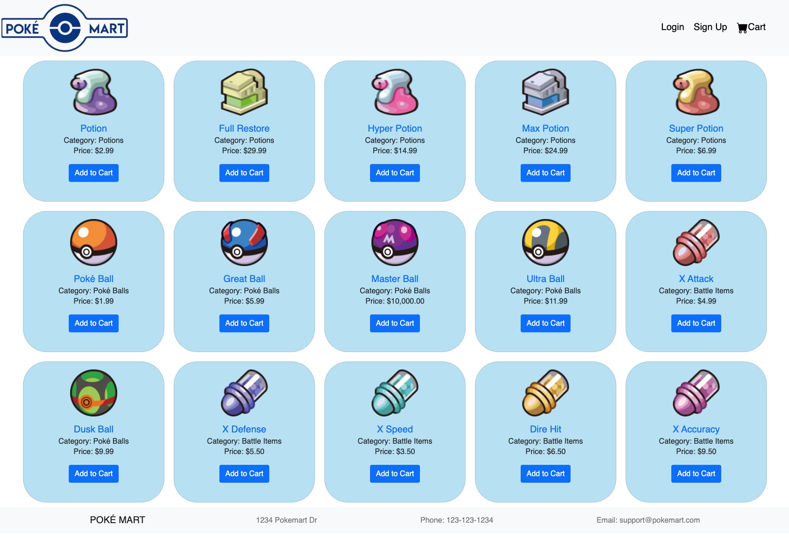
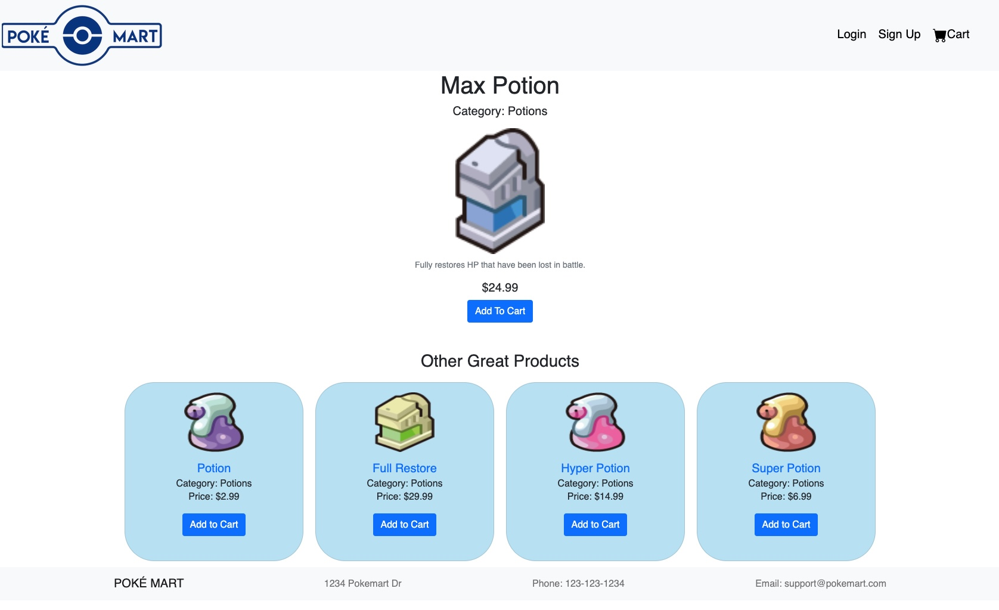
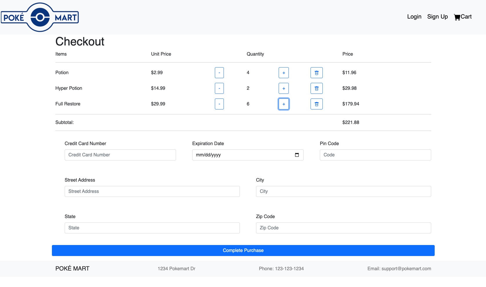
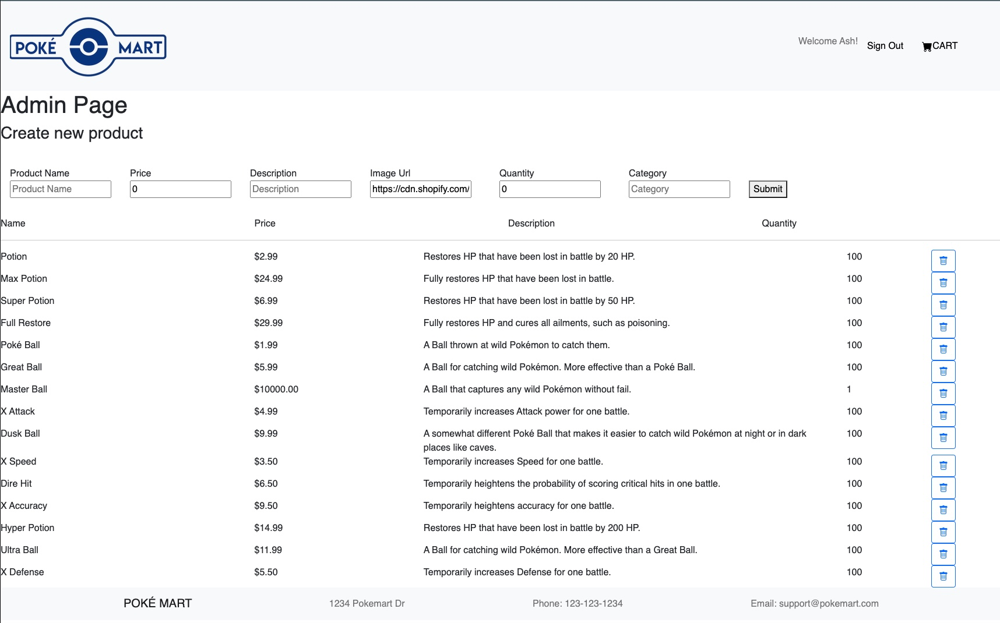

# Poké Mart

Live Demo: https://fsa-poke-mart.herokuapp.com/

An e-commerce website, Poké Mart is an online version of in-game store in the popular Pokémon franchise games. This was a group project built in five days during Fullstack Academy's 2202 cohort and is intended to showcase an example e-commerce website, including guest purchases, customer account sign-up and login, browsing different products, and checkout functionality. In addition, we implemented an admin page so administrators can create, update, and delete products on the site.

## Table of Contents

- [Poké Mart](#project-name)
  - [Table of Contents](#table-of-contents)
  - [General Information](#general-information)
  - [Technologies Used](#technologies-used)
  - [Features](#features)
  - [Screenshots](#screenshots)
  - [Setup](#setup)
  - [Project Status](#project-status)
  - [Room for Improvement](#room-for-improvement)
  - [Acknowledgements](#acknowledgements)
  - [Contact](#contact)
  - [License](#license)

## General Information

- This isn't a real store. This is just meant to showcase our newfound skills as software engineers and developers. The payment system does not work, payment information is not stored in a database, nor is it even recorded, as any numbers put into the credit card field will result in a 'purchase confirmation' page. Products are not actual products, and again, this isn't a real store, so no items will be sent.

## Technologies Used

- React
- Redux
- PostgreSQL
- Sequelize
- Node
- Express
- JSON Web Tokens
- React Bootstrap
- React Toastify
- Webpack

## Features

- View all items in the store
- View a single product for more information
- Add items to your cart (either as a guest or a signed in customer)
- Edit items in your cart (change quantity or remove an item completely)
- Checkout (not actually functional, just meant for demonstration purposes)
- Create an account to save cart information on a database
- Administrators can create, update, and delete products
- Administrators can view user information
- User data is secured using JSON web tokens saved in local storage

## Screenshots

## Setup

To run locally (assuming you have Node installed):

1. Clone this file onto your local machine
2. Navigate (cd) to the directory
3. Run 'npm install'
4. Run 'npm run start-server'

## Project Status

Project is _no longer being worked on_ due to group members moving on to other projects.

## Room for Improvement

Include areas you believe need improvement / could be improved. Also add TODOs for future development.

Room for improvement:

- Add categories to each product
- Add more than one quantity of a product without having to edit quantity in the checkout page
- Improve UI/UX experience
- Add a 'guest-to-logged-in-user' functionality so the cart persists after logging in
- View order history as a customer
- View and edit customer profile to update information
- Add product inventory feature so if all items are sold, a customer won't be able to add that item to their cart
- Add the ability for customer discounts through promo codes
- Add customer email confirmation of successful purchase
- Offer customers discounts through promo codes via email
- Make the site ADA Compliant (https://www.a11yproject.com/checklist/)
- Filter products by category
- Add pagination so only a certain number of products render
- View feature products at the top of the page
- Add products to wishlist
- Internationalization and localization

To do:

- Add guest cart functionality so customers don't have to be signed in to add items to a cart and checkout

## Acknowledgements

- This project was based on Fullstack Academy's Grace Shopper Project.

## Contact

Created by Rachel Or, Jessica Chen, Jason Ocasio, and Alec Eiber

Feel free to contact me if you have any questions

## License

MIT License

Copyright (c) 2018 Fullstack Academy

Permission is hereby granted, free of charge, to any person obtaining a copy
of this software and associated documentation files (the "Software"), to deal in the Software without restriction, including without limitation the rights to use, copy, modify, merge, publish, distribute, sublicense, and/or sell copies of the Software, and to permit persons to whom the Software is furnished to do so, subject to the following conditions:

The above copyright notice and this permission notice shall be included in all copies or substantial portions of the Software.

THE SOFTWARE IS PROVIDED "AS IS", WITHOUT WARRANTY OF ANY KIND, EXPRESS OR IMPLIED, INCLUDING BUT NOT LIMITED TO THE WARRANTIES OF MERCHANTABILITY, FITNESS FOR A PARTICULAR PURPOSE AND NONINFRINGEMENT. IN NO EVENT SHALL THE AUTHORS OR COPYRIGHT HOLDERS BE LIABLE FOR ANY CLAIM, DAMAGES OR OTHER LIABILITY, WHETHER IN AN ACTION OF CONTRACT, TORT OR OTHERWISE, ARISING FROM, OUT OF OR IN CONNECTION WITH THE SOFTWARE OR THE USE OR OTHER DEALINGS IN THE SOFTWARE.
